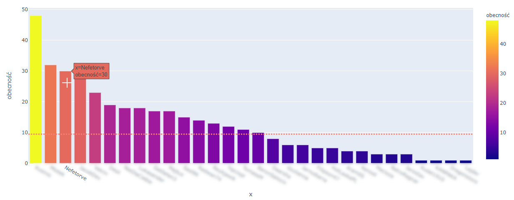
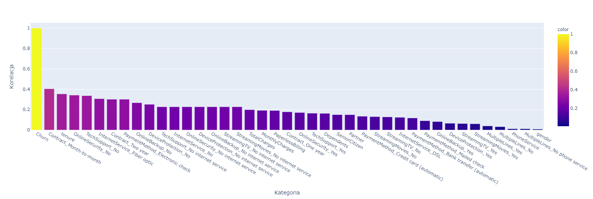
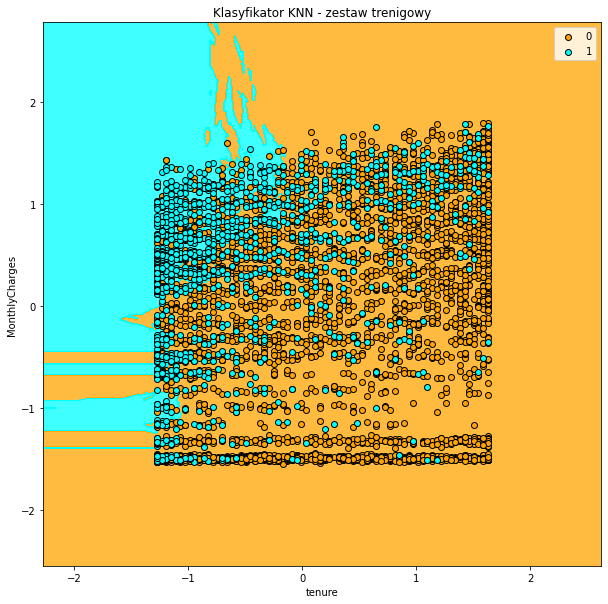
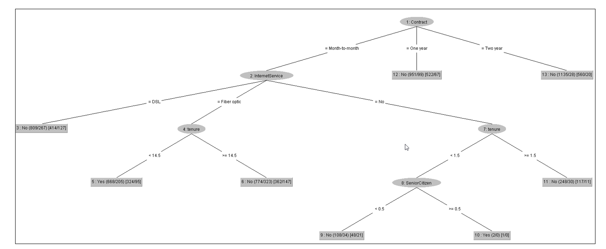
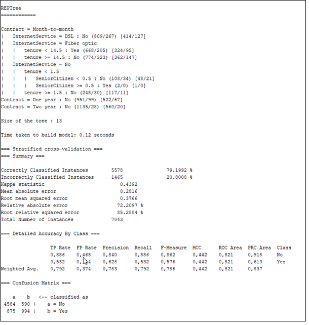
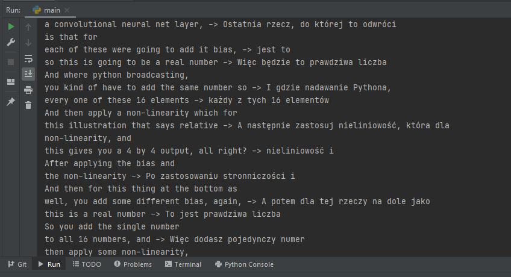
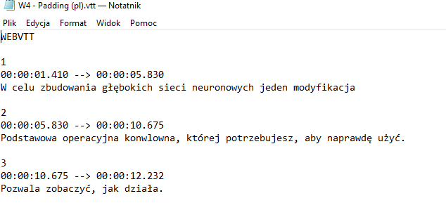

# Portfolio

  Repozytorium projektów zawiera projekty (zadania), z którymi pracowałam podczas studiów magisterskich na Uniwersytecie Ekonomicznym we Wrocławiu. W repozytorium znajdują się też projekty własne. Niektóre z projektów nie są opublikowane ze względu na zawarte w nich dane. 

## Projekty
### [Parki (projekt grupowy)](https://github.com/nefetorve/parki/blob/main/parki.ipynb)
#### 1. Cel projektu

  Celem projektu jest odnalezienie optymalnej trasy wycieczki, obejmującej jak największą liczbę parków, dla osoby przebywającej we Wrocławiu (turysty) w ciągu jednego dnia (maksymalnie 14h). Podczas rozwiązywania problemu należy wziąć pod uwagę czas podróży środkiem transportu MPK oraz czas spędzony w parku. Założenia projektu nie uwzględniają przerw w wycieczce ani utrudnień komunikacyjnych (np. korków). Powierzchnia parków zostanie opisana na podstawie dostępnych informacji w Internecie oraz za pomocą map Google. Czas spędzony w parku zostanie oszacowany na podstawie dostępnych narzędzi (mapy Google) oraz własnej wiedzy.

#### 2. Rozwiązanie problemu
Zadania jakie trzeba było wykonać:
* zebranie informacji dotyczących powierzchni parków, 
* zebranie informacji dotyczących przejazdu między parkami,
* utworzenie zbioru danych na podstawie powyższych informacji w pliku .xlsx,
* wykorzystanie biblioteki Pandas do odczytania plików,
* utworzenie czterech niezależnych algorytmów do optymalizacji trasy:
    * Algorytm zachłanny,
    * Algorytm losowy,
    * Algorytm bez przesiadek,
    * Algorytm z przesiadkami.
    
* Porównanie wyników algorytmów (podsumowanie)

| Rodzaj algorytmu        | Czas [min]           | Liczba parków  |
| ------------- |:-------------:| -----:|
| Algorytm zachłanny      | 832 | 21 |
| Algorytm losowy      | 821      |   18 |
| Algorytm bez przesiadek | 820      |    19 |
| Algorytm z przesiadkami| 835      |    21 |

#### 3. Zawartość repozytorium
Repozytorium zawiera rozwiązanie problemu poprzez wykorzystanie dwóch algorytmów: bez przesiadek i z przesiadkami.  
#### Dodatkowo wyznaczone trasy znajdują się pod następującym adresem: 
* https://www.google.com/maps/d/u/0/viewer?mid=1u4OcaXf29bgbJrQDvdyFxV0uN40FKkcj&ll=51.110817319075025%2C16.99588199999998&z=11
### Albion Online - obecność na ZvZ (projekt własny)
#### 1. Cel projektu

  Celem projektu było wygenerowanie statystyk dotyczących obecności graczy na ZvZ w gildii BladeWorX na podstawie zebranych danych przez Arkusz Google. Dane zostały dostarczone w formie pliku .xlsx.
Projekt pozwolił na zweryfikowanie miesięcznej obecności graczy.

#### 2. Rozwiązanie problemu
Zadania jakie trzeba było wykonać:
* Załadowanie danych z Excela Online w środowisku Jupyter Notebook
* Wydobycie unikalnych nazw graczy w tabeli
* Zsumowanie wszystkich wystąpień nazwy gracza
* Przedstawienie graficzne (wykres słupkowy) z wykorzystaniem biblioteki plotly.express

#### 3. Zawartość repozytorium
Repozytorium nie zostało udostępnione do podglądu ze względu na zawartość danych poufnych. 

### [Projekt telco-customer-churn (projekt własny)](https://github.com/nefetorve/telco-projekt/blob/main/160954_DataScience_projekt.ipynb)
Motywacją utworzenia projektu było otrzymanie większej oceny z kursu Data Science. 
#### 1. Cel projektu

  Problem badawczy dotyczy przewidywania zachowania klientów. Na podstawie zebranych danych, należy sprawdzić jakie czynniki sprawiają, że klienci rezygnują z usług danej firmy.

#### 2. Rozwiązanie problemu
Zadanie, które zostały wykonane to, m.in:
* Wykorzystanie dostępnych danych dostępnych na stronie: https://www.kaggle.com/blastchar/telco-customer-churn
* Sprawdzenie unikalnych wartości dla wszystkich atrybutów
* Sprawdzenie typu danych w zestawie danych
* Sprawdzenie podstawowych statystyk za pomocą funkcji describe()
* Czyszczenie danych (sprawdzenie, czy w zbiorze istnieją wartości null)
* Przekształcenie etykiet tekstowych na liczbowe (wykorzystanie kodowania gorącojedynkowego)
* Badanie korelacji pomiędzy Churn a pozostałymi parametrami
  
* Wykorzystanie algorytmu K-najbliższych sąsiadów (KNN)

#### 3. Zawartość repozytorium
Repozytorium zawiera cały projekt. Projekt został utworzony podczas trwania semestru zimowego 2020/21.
Czas na wykonanie projektu wynosił 7 dni.

### Projekt telco-customer-churn (projekt grupowy) w programie WEKA
Projekt został utworzony w grupie 3-osobowej podczas trwania kursu Data Mining w semestrze letnim 2019/2020. Do analizy danych wykorzystano narzędzie WEKA.
#### 1. Cel projektu

  Problem badawczy dotyczy przewidywania zachowania klientów. Na podstawie zebranych danych, należy sprawdzić jakie czynniki sprawiają, że klienci rezygnują z usług danej firmy.

#### 2. Rozwiązanie problemu
Zadanie, które zostały wykonane to, m.in:
* Sprawdzenie, czy nie ma brakujących danych
* Usunięcie zbędnych atrybutów 
* Pobranie pluginów, które umożliwiają tworzenie drzew decyzyjnych, bardziej wyraźnych, aby lepiej zaprezentować dane. 
* Analiza danych:
  * Algorytm RepTree 
  * Algorytm J48 
  * Random Tree 
  * Random forest 
  * Regresja liniowa 
  * Regresja logistyczna  
  * Reguły asocjacyjne	

#### 3. Zawartość repozytorium
Projekt nie został udostępniony.

#### 4. Wnioski 
####Z regresji liniowej można wywnioskować, że: 
* Najbardziej znaczącymi parametrami są decydującymi o zostaniu/odejściu klienta są: InternetService, OnlineSecurity, Contract.
#### Z drzew wyszły warunki, gdzie najwięcej klientów rezygnuje. Wyglądają one następująco:
* Klienci, którzy płacą za usługi co miesiąc są grupą w której są składane wypowiedzenia od umowy. 
* Najczęściej rezygnują osoby, które:
  * nie mają nikogo na utrzymaniu,
  * mają źle lub w ogóle niezabezpieczony sprzęt,
  * korzystają ze światłowodu, 
  * korzystają z wielu linii naraz,
  * nie potrafią dotrzeć do działu pomocy online,
  * nie wykupiły usług ochrony online
  *	są starsze
  *	nie korzystają z pomocy technicznej
  *	korzystają z usług streaming-owych. 
       
* Dodatkowo płeć nie wpływa na rezygnację klienta.
* Małżeństwa częściej rezygnują z usług niż osoby niezamężne. 
* Usługi telefoniczne nie mają wpływu na rezygnacje klientów.

Jeśli firma zmieni oferty i zastosuje się do wyników analizy to przełoży się to na zmniejszenie ilości rezygnacji i zwiększenie zysków.
Dla drzew decyzyjnych można stwierdzić, że najlepszy okazał się algorytm J48 (C4.5) w przypadku “use training set”. W przypadku walidacji skośnej można stwierdzić, że algorytmy J48 oraz REPTree zachowały się podobnie.
Głównie odchodzą starsze i młodsze osoby, które mają umowę month-to-month. 

### [Tłumaczenie tekstu z Coursera (projekt własny)](https://github.com/nefetorve/Translate_Coursera/blob/master/main.py)
#### 1. Cel projektu
Celem projektu jest zamiana tekstu w języku angielskim na język polski, żeby móc zrozumieć dokładniej przekaz kursu prowadzonego w języku angielskim. Tekst jest w formacie .vtt, więc z łatwością można go dołączyć do filmu.

#### 2. Rozwiązanie problemu
Podczas rozwiązywania problemu wykorzystano:
* bibliotekę Translator i webvtt
  
Opis kroków:
* do katalogu pobrano pliki .vtt w języku angielskim - pliki zawierają frazę (ang)
* dla każdego zdania w pliku utworzono tłumaczenie (en -> pl)
* nadpisano przetłumaczone zdania w odpowiednie miejsca
* zapisano jako nowy plik z końcówką (pl)
* zabezpieczono pliki, żeby nie było tłumaczenia z języka polskiego na język polski

#### 2. Zawartość repozytorium
Repozytorium zostało udostępnione. Tłumaczenie nie jest idealne, jednak na potrzeby własne jest wystarczające.

